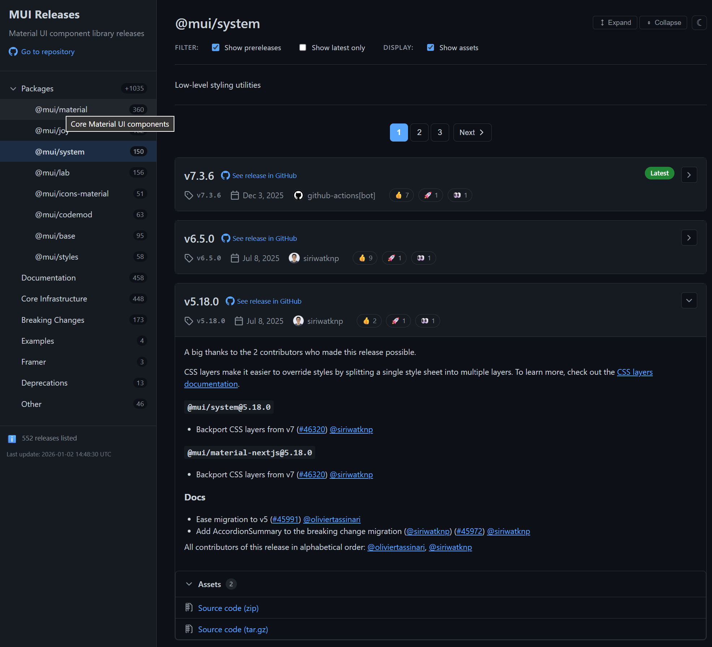

# GitHub Categorized Releases

A common pattern followed to organize GitHub repositories for complex projects is the [monorepo](https://en.wikipedia.org/wiki/Monorepo): one single repository holds the code for multiple related projects or products. The problem is that the repository releases are a single flat list that isn't well suited for managing releases of multiple products separately.

This project provides a far from perfect but functional solution for this: a [Node](https://nodejs.org/) script that generates a categorized releases site for GitHub repositories. Each release belongs to one or more categories via regex-based matching, and categories can be nested to form a hierarchical tree. The script can be used as is, or via [a GitHub action](action.yml) that publishes the generated site to [GitHub Pages](https://docs.github.com/en/pages/quickstart). The generated site is static: no code runs in the backend (but JavaScript is required in the browser).




## Features

- **Hierarchical navigation** - Organize releases into categories and subcategories.
- **Regex-based matching** - Flexible rules to classify releases by title, tag, body, and/or asset filenames.
- **GitHub-styled UI** - Familiar interface with release cards, badges, and assets.
- **Dark mode support** - Automatic theme based on system preferences, button to manually toggle mode available too.
- **Custom styling** - Override default CSS with your own styles.
- **Index page** - Optional markdown landing page.
- **URL persistence** - Bookmark specific categories and filter states.
- **Single-page or multi-page mode** - Choose depending on the amount of existing releases.


## Quick Start

This quick start guide generates a releases site for [material-ui](https://github.com/mui/material-ui), a repository with a clear separation of changelists for different components in each release:

1. Install [Node.js](https://nodejs.org/).

2. Download and unzip [the latest release](../../releases/latest). Or clone the repository, `cd` into it and run `npm install`.

3. Create a `config.yml` file there with the following content:

<details>

<summary>Configuration file contents</summary>

```yaml
site:
  title: "MUI Releases"
  description: "Material UI component library releases"
  max-releases: 300

defaults:
  cutoff-date: false

categories:
  - name: "Packages"
    description: |
      Releases containing changes to specific `@mui/*` packages.
    categories:
      - name: "@mui/material"
        description: Core Material UI components (includes legacy @material-ui/core)
        tooltip: "Core Material UI components"
        match-any:
          - body: ".?@mui/material@"
          - body: ".?@material-ui/core@"
      - name: "@mui/joy"
        description: Joy UI design system
        match-any:
          - body: ".?@mui/joy@"
      - name: "@mui/system"
        description: Low-level styling utilities
        match-any:
          - body: ".?@mui/system@"
          - body: ".?@material-ui/system@"
      - name: "@mui/lab"
        description: Experimental components
        match-any:
          - body: ".?@mui/lab@"
          - body: ".?@material-ui/lab@"
      - name: "@mui/icons-material"
        description: Material Design icons
        match-any:
          - body: ".?@mui/icons-material@"
          - body: ".?@material-ui/icons@"
      - name: "@mui/codemod"
        description: Migration codemods
        match-any:
          - body: ".?@mui/codemod@"
          - body: ".?@material-ui/codemod@"
      - name: "@mui/base"
        description: Unstyled base components
        match-any:
          - body: ".?@mui/base@"
      - name: "@mui/styles"
        description: Legacy styling solution
        match-any:
          - body: ".?@mui/styles@"
          - body: ".?@material-ui/styles@"
  
  - name: "Documentation"
    description: Releases with documentation improvements.
    match-any:
      - body: "##+ Docs"

  - name: "Core Infrastructure"
    description: Build system, tooling, and internal changes.
    match-any:
      - body: "##+ Core"

  - name: "Breaking Changes"
    description: |
      **Important:** These releases contain breaking changes.
      Review carefully before upgrading.
    match-any:
      - body: "##+ Breaking"
    latest-match: false

  - name: "Examples"
    description: Example project updates.
    match-any:
      - body: "##+ Examples"

  - name: "Framer"
    description: Framer design tool integration.
    match-any:
      - body: "##+ Framer"

  - name: "Deprecations"
    description: Releases announcing deprecations.
    match-any:
      - body: "##+ Deprecation"

unmatched:
  show: true
  name: "Other"
```

</details>

4. Run `node src/generate-release-page.js --repo mui/material-ui --config config.yaml`

5. Open `_site/index.html` in your browser.

For more details on the script arguments, run `node src/generate-release-page.js --help`. For more details on the configuration file, see [Configuration file](#configuration-file) and take a look at [the example configuration file](config.example.yaml).


## Usage Scenarios

### Scenario 1: Generate (and optionally host) the site manually

If your repository doesn't get new releases often you can simply run the script manually (as in the quick start above) and host the resulting site in the repository itself (using GitHub Pages) or elsewhere.

Running the script locally is also useful to experiment with the various settings available for the configuration file. When doing so you may want to use the `--save-releases` script argument to generate a local json file with information about all the existing releases, you can later use `--releases-file` to take this file as the source of releases information instead of querying the GitHub API every time (you first run the script once with `--repo` and `--save-releases`, and then as many times as you need with `--releases-file`).

For repositories that get frequent releases, or when running the script locally isn't convenient for whatever reason, offloading the generation of the page to a GitHub action that fires whenever a new release is published (or an existing release changes) and publishes the generated site in GitHub Pages is a better option, and that's what the remaining scenarios discuss.


### Scenario 2: New GitHub Pages site (repository not using Pages yet)

If your repository doesn't have GitHub Pages enabled yet, you can enable it and then add a workflow that uses the built-in action to generate the site and publish it in the root of the Pages site. Follow these setup steps:

1. Create `.github/categorized-releases/config.yaml` with the required configuration, see [Configuration file](#configuration-file) and [the example configuration file](config.example.yaml).
2. Create `.github/workflows/releases.yml` with this content:

<details>

<summary>Workflow file contents (using "upload artifacts" and "deploy to Pages" actions)</summary>

```yaml
name: Generate Release Page

on:
  workflow_dispatch:
  release:
    types: [published, edited, deleted]

permissions:
  contents: read
  pages: write
  id-token: write

concurrency:
  group: pages
  cancel-in-progress: true

jobs:
  generate-and-deploy:
    runs-on: ubuntu-latest
    environment:
      name: github-pages
      url: ${{ steps.deployment.outputs.page_url }}
    steps:
      - uses: actions/checkout@v4

      - name: Generate categorized releases page
        uses: Konamiman/github-categorized-releases@master
        with:
          config: .github/releases-config.yaml

      - name: Upload artifact
        uses: actions/upload-pages-artifact@v3
        with:
          path: _site

      - name: Deploy to GitHub Pages
        id: deployment
        uses: actions/deploy-pages@v4
```

</details>

3. Go to **Settings > Pages** and set **Source** to "GitHub Actions".
4. Run the workflow manually or publish a release.

This is the standard way to publish content to GitHub pages using GitHub actions, but it has a problem: it won't work properly (the Pages site won't be actually regenerated) if you make a change that doesn't involve pushing new commits to the repository (e.g. modifying the description of an existing release); this is a known issue on GitHub's side.

As a workaround for this issue you can use [the peaceiris/actions-gh-pages action](https://github.com/peaceiris/actions-gh-pages) instead:

1. Create `.github/categorized-releases/config.yaml` with the required configuration.
2. Create `.github/workflows/releases.yml` with this content:

<details>

<summary>Workflow file contents (using deploy to branch)</summary>

```yaml
name: Generate Release Page

on:
  workflow_dispatch:
  release:
    types: [published, edited, deleted]

permissions:
  contents: write

jobs:
  generate-and-deploy:
    runs-on: ubuntu-latest
    steps:
      - uses: actions/checkout@v4

      - name: Generate categorized releases page
        uses: Konamiman/github-categorized-releases@v1
        with:
          token: ${{ secrets.GITHUB_TOKEN }}

      - name: Deploy to GitHub Pages
        uses: peaceiris/actions-gh-pages@v4
        with:
          github_token: ${{ secrets.GITHUB_TOKEN }}
          publish_dir: ./_site
```

</details>

3. Go to **Settings > Pages** and set **Source** to "Deploy from a branch", then in the branch selector choose `gh-pages`.
4. Run the workflow manually, publish a release, or edit an existing release.


### Scenario 3: Existing GitHub Pages from Actions workflow

If you already have a GitHub Pages site deployed via an Actions workflow (e.g., Jekyll, Hugo, or custom build), you can add the releases page as a subdirectory.

**Setup:** Create the config file as usual, then add the releases action to your existing workflow, **after** your main build step. Use `output` to specify the subdirectory:

```yaml
jobs:
  build:
    steps:
      - uses: actions/checkout@v4

      # Your existing build step (Jekyll, Hugo, etc.)
      - name: Build with Jekyll
        uses: actions/jekyll-build-pages@v1
        with:
          destination: _site

      # Add releases page to _site/releases/
      - name: Generate releases page
        uses: Konamiman/github-categorized-releases@v1
        with:
          token: ${{ secrets.GITHUB_TOKEN }}
          output: _site/releases    # Subdirectory within your site

      # Proceed with the deployment
```


### Scenario 4: Existing GitHub Pages from `/docs` directory

If your GitHub Pages site is served from the `/docs` directory in your repository, you can generate the releases page locally and commit it to a subdirectory, e.g. `/docs/releases`:

```bash
# Generate releases page into docs/releases
node src/generate-release-page.js \
  --repo owner/repo \
  --token $GITHUB_TOKEN \
  --config .github/categorized-releases/config.yaml \
  --output docs/releases

# Commit and push
git add docs/
git commit -m "Update releases page"
git push
```

You can automate this with a workflow that commits to the repository:

```yaml
name: Update Releases Page

on:
  release:
    types: [published]
  workflow_dispatch:

permissions:
  contents: write    # Needed to push commits

jobs:
  update:
    runs-on: ubuntu-latest
    steps:
      - uses: actions/checkout@v4

      - uses: Konamiman/github-categorized-releases@v1
        with:
          token: ${{ secrets.GITHUB_TOKEN }}
          output: docs/releases

      - name: Commit and push
        run: |
          git config user.name "github-actions[bot]"
          git config user.email "github-actions[bot]@users.noreply.github.com"
          git add docs/
          git diff --staged --quiet || git commit -m "Update releases page"
          git push
```


### Scenario 5: Fetching releases from a different repository

You can generate a releases page for any public repository (or private with appropriate token):

```yaml
- uses: Konamiman/github-categorized-releases@v1
  with:
    token: ${{ secrets.GITHUB_TOKEN }}
    repository: other-owner/other-repo    # Fetch from different repo
```

Or via CLI:

```bash
node src/generate-release-page.js \
  --repo other-owner/other-repo \
  --token $GITHUB_TOKEN \
  --config config.yaml
```


## Configuration file

This section contains a brief conceptual description of the configuration file required by the site generation script. See [config.example.yaml](config.example.yaml) for a comprehensive reference with example values for all options.


### Page settings

The root `page` section contains general site configuration like title, description, favicon, or custom CSS styles. It also allows to configure an optional landing page with markdown content (inline markdown or in a dedicated file).

Some settings accept local file paths that can be absolute or relative. Relative paths are resolved from the config file's directory.


### Category configuration

The root `categories` section configures which release categories exist and how releases are categorized. Each category containing at least one release gets an entry in the left sidebar of the generated site.

A release can be included in zero, one, or multiple categories based on one or more _matchers_. A matcher is a regular expression that applies to the release tag, title, body or list of assets (negative matchers exist too). There are also two boolean matchers: "is prerelease" and "is latest".

When more than one matcher is defined for a category they are evaluated together using AND logic (a release must match all the matchers in order to be included in the category); OR logic can be used by inserting a `match-any` group. There are also `match-all` groups, useful to be included inside `match-any`.

Categories can be nested to any level by including additional `categories` items inside a category item. A category can have no matchers if it's just a container for other categories.

The root `unmatched` section allows configuring whether releases not matching any of the defined categories are displayed in the site, and if so, under which category name (e.g. "Other"). It also supports `max-displayed`, `cutoff-date`, and `latest-match` settings, just like regular categories.

Here's an example:

```yaml
categories:
  - name: "Versioned releases"
    description: "Releases with a version number."

    categories:
      - name: "Final versions"

        # Tag starts with "v(digit)"
        # AND title starts with "Final release of v(digit)"
        # AND tag doesn't end with -beta or -alpha
        # AND is not a prerelease
        tag: "^v\\d+"
        title: "^Final release of v\\d+"
        tag-not: "-(beta|alpha)$"
        is-prerelease: false

      - name: "Prereleases"

        # Tag starts with "v(digit)"
        # AND is a prerelease
        # AND either (title starts with "Beta release of v(digit)" AND tag ends with "-beta")
        #         OR (title starts with "Alpha release of v(digit)" AND tag ends with "-alpha")
        tag: "^v\\d+"
        is-prerelease: true
        match-any:
          - match-all:
              - tag: "-beta$"
              - title: "^Beta release of v\\d+"
          - match-all:
              - tag: "-alpha$"
              - title: "^Alpha release of v\\d+"
```


### Global matchers

In addition to the per-category matchers, there are two optional root sections that you can use to define global matchers that apply to all releases regardless of category: `include` and `exclude`. Only releases that match all the `include` conditions AND don't match any of the `exclude` conditions will be considered for inclusion in the site. These sections support the full matcher syntax (including `match-any`, `match-all`, and nesting).

For example, if you want to include only versioned releases in the site, and don't want any prerelease to be included at all, you can use this:

```yaml
include:
  tag: "^v\\d+"

exclude:
  is-prerelease: true
```


### Limiting the amount of releases displayed

For repositories with a huge number of releases you may want to limit how many of these are included in the generated site, and in fact there are limits applied by default. This is how the script processes the releases and decides which ones get included in the site:

1. `site.max-releases` is a hard limit on how many releases will be processed: the script fetches information of at most that many releases (in descending publication date order) from the GitHub API or the releases file. A value of `false` disables this limit. The default value is 1000.
2. Then the global matchers are applied to further filter out the list of releases.
3. Releases are then categorized by applying the category matchers. There are two per-category settings that allow to limit the amount of releases included:
   * `max-displayed`: hard limit on how many releases will be displayed in the category (again, sorted by descending date). Use `false` to disable this limit.
   * `cutoff-date`: releases older than this date (ISO date, or amount of days/weeks/months/years to subtract from the current date) will be left out. Use `false` to disable this limit.
4. Finally, releases not matching any category are displayed or left out depending on the `unmatched` section. 


### "Latest" matching

By default, a "Latest" badge will be shown for the most recent release in each category. However this can be customized by adding a `latest-match` key in the category settings: it can be an array of matchers (all the matching releases will get the badge), `false` (no releases will get the badge at all) or `newest` (the default behavior).


### Category settings defaults and inheritance

The `latest-match`, `cutoff-date` and `max-displayed` per-category configuration keys are actually inherited by nested categories, and there are defaults that are applied to categories that don't explicitly override the values and don't have any parent value to inherit. The rules are as follows:

- There's an optional `defaults` section that allows you to define default values for these keys.
- If not explicitly included in `defaults`, the implicit values are: `latest-match` = `newest`, `max-displayed` = `100`, `cutoff-date` = `-1y` (one year from current date).
- A category that doesn't define an explicit value for these keys will inherit the value from the parent category (top-level categories inherit the defaults instead).
- When a category defines an explicit value for these keys, its nested categories inherit it.
- When a category sets one of these keys to `null`, its value reverts to the default.

See [config.example.yaml](config.example.yaml) for a full inheritance example.


### Single-page vs multi-page

By default the script will generate the site as one single HTML file (plus one JavaScript file and one CSS file). While this works great when the number of releases is small, when there are more than about 100 releases per category and 500 releases in total the site navigation starts to become somewhat slow.

The root `multi-page` section allows enabling multi-page site generation. In this mode one separate HTML file will be generated per category and page (the default page size is 50, that's configurable) and page navigation bars will be rendered on the top and bottom of each page as appropriate. These HTML files will contain just the main content of the page (the release cards) and they will be loaded and injected in the page as needed using JavaScript.

Note that since pages will be loaded via JavaScript, multi-page sites can't be loaded locally via browser's "Open file" (these sites need to be served by a web server).


### Latest page

The optional root `latest-page` section enables a special page that aggregates all releases marked as "latest" across all categories. This provides a quick overview of the most recent stable releases.

```yaml
latest-page:
  enable: true
  title: "Latest Releases"              # Optional, defaults to "Latest"
  description: "Most recent releases"   # Optional markdown description
```

The page offers two display modes:

- **Releases**: Shows full release cards (same format as regular categories), with pagination in multi-page mode.
- **Assets**: Shows a table of downloadable files from all latest releases, excluding source code archives. Assets can be sorted by date (ascending/descending) or name (A-Z/Z-A). Duplicate filenames across releases show only the most recent version.

Note: Which releases are marked as "latest" is determined by the `latest-match` setting in each category. By default, this is the newest release in each category.


## GitHub markdown rendering

By default, the script uses a local markdown renderer ([marked](https://www.npmjs.com/package/marked)) to convert release descriptions to HTML. This is fast but may not render some GitHub-specific markdown features correctly (e.g., certain emoji shortcodes, special syntax extensions).

If you need pixel-perfect rendering matching GitHub's display, use the `--github-markdown` script flag or set `github-markdown: true` in the action. This uses GitHub's API to render markdown, which is slower (one API call per release) but produces identical output to what you see on GitHub.


## Action inputs reference

| Input | Description | Default |
|-------|-------------|---------|
| `token` | GitHub token for API access | `''` |
| `repository` | Repository to fetch releases from | Current repository |
| `config` | Path to configuration file | `.github/categorized-releases/config.yaml` |
| `output` | Output directory for generated site | `_site` |
| `github-markdown` | Use GitHub API for markdown rendering | `false` |


## CLI options reference

Either `--repo` or `--releases-file` is required.

```
--repo <owner/repo>     Repository to fetch releases from (or full GitHub URL)
--releases-file <path>  Load releases from local JSON file instead of API
--token <token>         GitHub API token (or use GITHUB_TOKEN env var)
--config <path>         Config file path, local or URL (default: .github/categorized-releases/config.yaml)
--output <dir>          Output directory (default: _site)
--save-releases <path>  Fetch ALL releases and save to JSON (config not used, no page generated)
--github-markdown       Use GitHub API for markdown rendering (slower but more accurate)
--help                  Show help
```


## Disclaimer: AI usage

All the code, markup and styles for this project have been generated by an AI agent (more precisely, [Claude](https://www.claude.com/product/claude-code)) through a long series of prompts. That's because:

1. I'm a backend developer. I might have figured out the JavaScript eventually, but definitely not the HTML and the CSS.
2. This is a pragmatic project: the goal was not to have fun or to learn something new (not the _main_ goal, at least), but to come up with an useful tool.
3. This is a side project developed in my free time, of which I don't have as much as I'd like.

If you are a seasoned front-end developer you will likely be horrified by the code, the design and/or the usability of the script or the generated site. If so, great! Please feel free to submit a pull request or two with improvements or fixes (or an issue or two... but of course I'll handle these using AI too).
